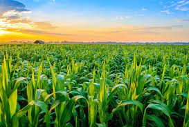

# 🌱 Crop Recommendation System Using Machine Learning

[](https://www.python.org/)
[](https://flask.palletsprojects.com/)
[](https://scikit-learn.org/)
[](https://opensource.org/licenses/MIT)

<p align="center">
  
</p>

An AI-powered Precision Agriculture decision support system that recommends the most suitable crop to cultivate based on environmental, meteorological, and soil nutrient conditions.

---

## 📌 Overview

Selecting the right crop for specific soil and climatic conditions is vital to maximizing agricultural yield and optimizing resource utilization. This project leverages Machine Learning to provide accurate crop recommendations based on seven key parameters:
- **Soil Nutrients:** Nitrogen ($N$), Phosphorus ($P$), Potassium ($K$)
- **Environmental Factors:** Temperature, Humidity, Soil pH, and Rainfall

The application features an interactive modern web UI built with **Flask**, as well as a JSON REST API endpoint for integration with external platforms and IoT devices.

---

## ✨ Features

- 🎯 **High Accuracy Predictions:** Pre-trained machine learning pipeline utilizing scaled input features.
- 📊 **Dual Scaling Pipeline:** Normalized and standardized preprocessing (`MinMaxScaler` + `StandardScaler`).
- 🌐 **Modern Responsive Web Interface:** Clean, dark-mode glassmorphic user interface.
- ⚡ **REST API Integration:** `/predict` route supports both HTML form submissions and raw JSON payloads.
- 🌾 **22 Supported Crops:**
  > Rice, Maize, Jute, Cotton, Coconut, Papaya, Orange, Apple, Muskmelon, Watermelon, Grapes, Mango, Banana, Pomegranate, Lentil, Blackgram, Mungbean, Mothbeans, Pigeonpeas, Kidneybeans, Chickpea, Coffee.

---

## 🗂️ Project Structure

```bash
Crop_Recommendation_System_Using_ML/
│
├── Crop_recommendation.csv    # Dataset with 2200 soil & weather samples
├── app.py                     # Flask web application & prediction logic
├── model.pkl                  # Trained Machine Learning classification model
├── minmaxscaler.pkl           # Trained MinMaxScaler
├── standscaler.pkl            # Trained StandardScaler
├── requirements.txt           # Python dependencies
├── .gitignore                 # Files excluded from git tracking
└── templates/
    └── index.html             # Front-end UI template
```

---

## 🔬 Dataset & Features

The dataset (`Crop_recommendation.csv`) contains the following features:

| Parameter | Unit | Description |
| :--- | :--- | :--- |
| **Nitrogen ($N$)** | kg/ha | Ratio of Nitrogen content in soil |
| **Phosphorus ($P$)** | kg/ha | Ratio of Phosphorous content in soil |
| **Potassium ($K$)** | kg/ha | Ratio of Potassium content in soil |
| **Temperature** | °C | Ambient temperature |
| **Humidity** | % | Relative atmospheric humidity |
| **pH** | 0 - 14 | Soil acidity or alkalinity score |
| **Rainfall** | mm | Annual / seasonal rainfall |
| **Label** | Category | Target crop name (22 distinct crops) |

---

## 🚀 Quick Start & Installation

### 1. Clone the Repository
```bash
git clone https://github.com/M0saeed/Crop_Recommendation_System_Using_ML.git
cd Crop_Recommendation_System_Using_ML
```

### 2. Set Up a Virtual Environment (Recommended)
```bash
# Windows
python -m venv venv
venv\Scripts\activate

# Linux / macOS
python3 -m venv venv
source venv/bin/activate
```

### 3. Install Dependencies
```bash
pip install -r requirements.txt
```

### 4. Run the Application
```bash
python app.py
```

Visit `http://127.0.0.1:5000` in your web browser.

---

## 🔌 API Documentation

### `POST /predict`
Send soil and climate parameters to receive crop recommendations.

#### **Request (JSON)**:
```json
{
  "Nitrogen": 90,
  "Phosporus": 42,
  "Potassium": 43,
  "Temperature": 20.88,
  "Humidity": 82.00,
  "Ph": 6.50,
  "Rainfall": 202.94
}
```

#### **Response (JSON)**:
```json
{
  "status": "success",
  "crop": "Rice",
  "confidence": 98.45,
  "result_message": "The best crop for cultivation is: Rice (Confidence: 98.45%)"
}
```

#### **cURL Example**:
```bash
curl -X POST http://127.0.0.1:5000/predict \
  -H "Content-Type: application/json" \
  -d '{"Nitrogen":90, "Phosporus":42, "Potassium":43, "Temperature":20.88, "Humidity":82.0, "Ph":6.5, "Rainfall":202.94}'
```

---

## 🛠️ Built With

- **Python** - Core language
- **Flask** - Web framework & REST API
- **Scikit-Learn** - Machine learning modeling & feature preprocessing
- **NumPy & Pandas** - Numerical processing & dataset operations
- **HTML5 & Modern CSS** - Front-end user interface

---

## 👤 Author

- **Mohamed Saeed** - [@M0saeed](https://github.com/M0saeed)

---

## 📄 License

This project is licensed under the MIT License - see the [LICENSE](LICENSE) file for details.
